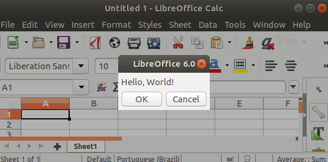
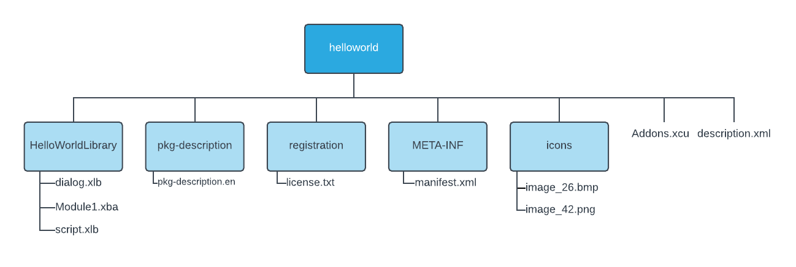

# helloworld-libreoffice-extension
Hello World LibreOffice extension (helloworld.oxt) - Adds a button to standand toolbar of LibreOffice Calc, when button is clicked, a dialog with "Hello, World!" shows. It has also a [Tutorial](https://wiki.documentfoundation.org/Create_a_Hello_World_LibreOffice_extension).

  

### How to install

1. Open LibreOffice Calc.
2. Go to Tools > Extension Manager
3. Click ADD button, and select the extension helloworld.oxt.
4. Follow the installation instructions.
5. Restart LibreOffice Calc.

### Hello World extension file structure

  

### How to package the extension

1. Select all files inside helloworld folder (it does not work if you compress the entire folder, because description.xml must be located at the top level).
2. Right-click and compress to helloworld.zip.
3. Rename helloworld.zip to helloworld.oxt.
